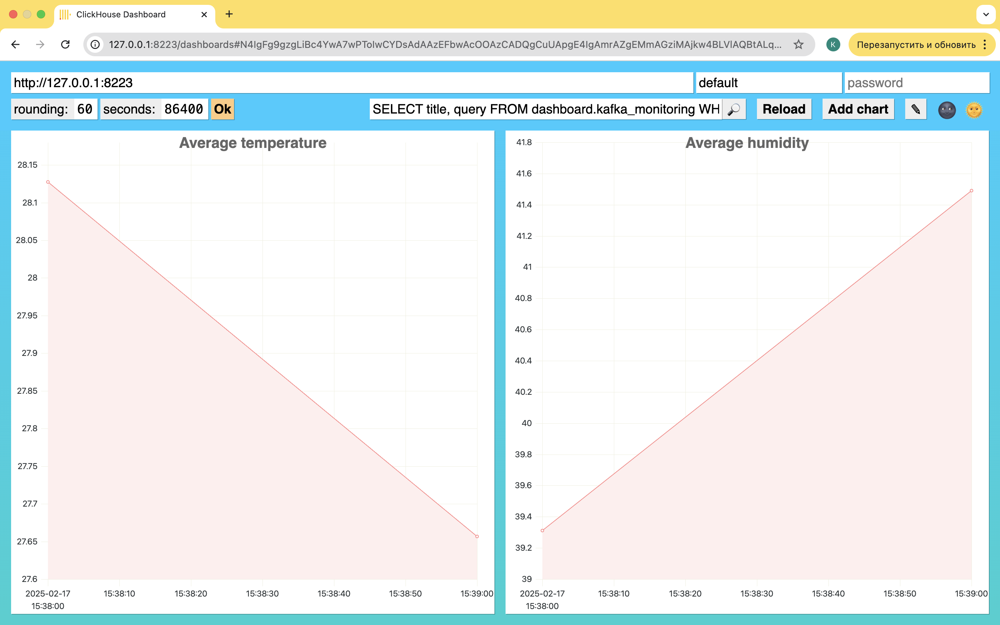

# otus-clickhouse-diploma

Репозиторий для проектной работы по курсу "ClickHouse для инженеров и архитекторов БД"

## setup

```bash
# поднимаем инфру
./docker-compose up

# Поднимаем структуру БД
docker exec -it ch1 clickhouse-client --queries-file /tmp/scripts/01_rbac.sql
docker exec -it ch1 clickhouse-client --queries-file /tmp/scripts/00_databases_and_tables.sql

# ставим суперсет
docker exec -it superset superset fab create-admin \
          --username admin \
          --firstname Superset \
          --lastname Admin \
          --email admin@superset.com \
          --password admin

docker exec -it superset superset db upgrade
docker exec -it superset superset init
docker exec -it superset python -m pip install clickhouse-connect
docker restart superset
```

## Вводная часть

Описание файлов в репозитории
- airflow
  - dags - даги в эирфлоу
  - scripts - баш-скрипт, который используем для раскатки эирфлоу (заводим пользователя, ставим необходимые пакеты)
- ch 
  - init_db - скрипты, создающие необходимые объекты в БД
  - replica01 && replica02 - конфиги на ноды кликхауса
- minio - директория в гитигноре, для локальной сверки что все бэкапы/гибридное хранение успешны
- src - вспомогательный скрипт с кафка продюссером на python (для демонстрации связки кафка-кликхаус)

Описание структуры БД
- streams - База данных с консьюмерами кафки
- raw - База данных с сырыми данными из кафки (данные хранятся как json в строке + метаданные кафки)
- parsed - База данных с распаршенными данными из кафки
- dict - База данных со словарями
- airflow_metadata - База данных с метаданными Airflow (движок PostgreSQL)
- ext - База данных, куда складываем данные из внешних систем (апи, парсинг и тд)
- prod - База данных, куда складываем данные из прода (ОЛТП базы данных)
- datamart - Основная БД для запросов со стороны BI. Единственная таблица - datamart.trips
- dashboard - БД для мониторинга

## Технологии/ПО/Подходы, которые были использованы в проекте (и почему)

- Clickhouse - основная аналитическая БД
- Airflow - оркестратор, через который мы:
  - забираем данные из внешних систем
  - с определенной периодичностью снимаем бэкапы
- PostgreSQL - выполняет 2 функции
  - внутренняя СУБД для работы Airflow
  - имитация прода (OLTP) - отсюда забираются нормализованные таблицы через окрестратор, словари и специальный движок PostgreSQL
- Kafka - еще один источник данных
- Minio - для хранения бэкапов
- Superset - для аналитических дашбордов

Предложения по масштабированию:
- мониторинг сейчас сделан за счет встроенного функционала кликхауса - эндпоинта `/dashboards`, для продового варианта я бы рассмотрел связку прометеуса и графаны (вариант развертывания представлен здесь)
- логи системы сейчас идут в специальные таблицы, по мере усложнения системы (увеличения количества нод) я бы рассмотрел использование ELK-стека 

Схема архитектуры


## Внешние источники

В качестве внешних источников были выбраны:
1. PosgreSQL - есть [даг в эирфлоу](./airflow/dags/pg_to_ch.py), который переносит данные (имитация связки OLTP и OLAP через оркестратор)
```sql
-- убедимся в работоспособности после отработки дага
select count() from prod.dag_run;
/*
   ┌─count()─┐
1. │      39 │
   └─────────┘

1 row in set. Elapsed: 0.015 sec. 
*/
```
2. API - взял из открытых источников, реализовал как ReplacingMT таблицу чтобы избежать необходимости update-ов строк
3. Внешнее хранилище (с3)

Успешные даг раны представлены на скриншоте 


## RBAC

До создания объектов базы раскатываются объекты RBAC. В проекте представлены следующие сущности
- пользователи
- роли
- право
Также создал именованную коллекцию для упрощения доступа

```sql
select * from system.roles;
/*
   ┌─name────────────┬─id───────────────────────────────────┬─storage─────────┐
1. │ observer_r      │ 7b4d9a4a-9677-220d-2ee1-12e30c90fda8 │ local_directory │
2. │ bi_r            │ 9b49a98a-f84b-886d-e2a4-16eeb87691a9 │ local_directory │
3. │ airflow_r       │ 444c014a-d933-af58-d468-a8f02b35baaf │ local_directory │
4. │ data_engineer_r │ 5a4c792e-9c70-e7ad-b1b0-e989cdaf2c84 │ local_directory │
5. │ monitoring_r    │ 7c44ec3f-d9c7-ba88-e0bc-4c46a83e91ba │ local_directory │
6. │ analytic_r      │ 6e441ff2-fd21-afcb-a5a4-9fbfb1e1c5b6 │ local_directory │
   └─────────────────┴──────────────────────────────────────┴─────────────────┘

6 rows in set. Elapsed: 0.013 sec. 
*/
```

## Backups and Storage policies

Для холодного хранения данных и для бэкапов были подключео объектное хранилище. В качестве объектного хранилища остановился на Minio  (легкая настройка, open-source). Конфиги представлены в примонтированных директориях, чтобы убедиться ,что все работает, проверим системные таблицы:
```sql
select policy_name, volume_name from system.storage_policies;
/*
   ┌─policy_name─┬─volume_name─┐
1. │ default     │ default     │
2. │ default     │ s3_backup   │
3. │ s3_backup   │ s3_backup   │
   └─────────────┴─────────────┘

3 rows in set. Elapsed: 0.009 sec. 
*/
select name, path, type, object_storage_type from system.disks;
/*
   ┌─name──────┬─path─────────────────────────────────┬─type──────────┬─object_storage_type─┐
1. │ default   │ /var/lib/clickhouse/                 │ Local         │ None                │
2. │ s3_backup │ /var/lib/clickhouse/disks/s3_backup/ │ ObjectStorage │ S3                  │
3. │ s3_cache  │ /var/lib/clickhouse/disks/s3_cold/   │ ObjectStorage │ S3                  │
4. │ s3_cold   │ /var/lib/clickhouse/disks/s3_cold/   │ ObjectStorage │ S3                  │
   └───────────┴──────────────────────────────────────┴───────────────┴─────────────────────┘

4 rows in set. Elapsed: 0.007 sec. 
*/
```

Бэкапы осуществляются ежечасно по расписанию через эирфлоу. Раз в неделю в 3 ночи по субботам снимаются полные бэкапы, остальные - инкрементальные. Бэкапы выполняются за счет sql:
```sql
-- full backup
BACKUP ALL ON CLUSTER otus TO Disk('s3_backup', 'backup_20250216');
-- incremental
BACKUP ALL ON CLUSTER otus TO Disk('s3_backup', 'backup_20250216_08')
    SETTINGS base_backup = Disk('s3_backup', 'test_backups')
```

Для холодного хранения настроен сторадж. Вставим данные и проверим перемещение.
```sql
INSERT INTO datamart.trips (trip_id, pickup_datetime) 
SELECT 1, today()
from numbers(100)
;

ALTER TABLE datamart.trips  MATERIALIZE TTL ;

SELECT 
    table,
    disk_name,
    formatReadableSize(sum(data_compressed_bytes)) AS compressed_size,
    formatReadableSize(sum(data_uncompressed_bytes)) AS uncompressed_size,
    sum(rows) AS total_rows
FROM system.parts
WHERE active = 1 and table = 'trips'
GROUP BY table, disk_name
ORDER BY table, disk_name;
/*
   ┌─table─┬─disk_name─┬─compressed_size─┬─uncompressed_size─┬─total_rows─┐
1. │ trips │ default   │ 674.00 B        │ 4.72 KiB          │        100 │
2. │ trips │ s3_cold   │ 120.71 MiB      │ 206.83 MiB        │    3000317 │
   └───────┴───────────┴─────────────────┴───────────────────┴────────────┘

2 rows in set. Elapsed: 0.089 sec. 
*/
```


## Мониторинг

Промежуточный вариант - встроенный мониторинг на эндпоинте dashboards. Допустим, мы следим за событиями из кафки (данные с каких то датчиков). Для мониторинга заходим в браузере на `127.0.0.1:8223/dashboards` и вбиваем следующий запрос:
```sql
SELECT title, query FROM dashboard.kafka_monitoring WHERE dashboard = 'Overview'
```



Также поднят суперсет. Логинимся в суперсете и добавляем подключение к базе (справа settings -> database connections). После этого можем идти и строить наши визуализации. В качестве датасета используем денормализованную таблицу `datamart.trips` в виде кастомного sql-запроса `select * from datamart.trips limit 5;`.  

Примеры визуализаций


